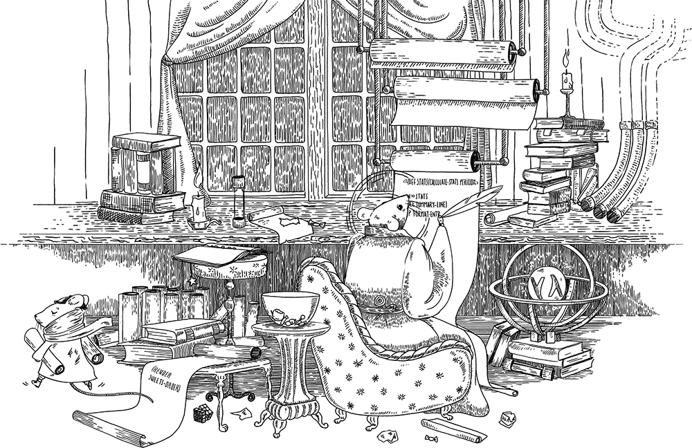

# Ash Ra Template

Simplistic template library featuring Clojure language processing with Ruby 2.0 ERB-esque syntax.



**Motivation**: Of the Clojure templating libraries we found, none seemed to directly assist in porting a non-trivial amount of ERB-templated content from [Middleman](https://github.com/middleman/middleman) to a custom Clojure-based static site generation tool.
We find that the ERB syntax contrasts well with Clojure, and being able to in-line arbitrary Clojure code is intoxicatingly pragmatic (also expressed as: Enough rope to hang oneself).
Seeking to wield such expressive power, we wrote Ash Ra Template, or **ART**.

Works with Clojure 1.9 and newer.

[](https://circleci.com/gh/vivid-inc/ash-ra-template/tree/master)
[](https://codecov.io/gh/vivid-inc/ash-ra-template)
[](https://clojars.org/vivid/ash-ra-template)


## Usage

Include this library from Clojars by adding ``[vivid/ash-ra-template "0.3.0"]`` to ``:dependencies`` in your ``project.clj``.

Rendering a template string is easy:
```clojure
(require [vivid.art :as art])

(art/render "There were <%= (+ 1 2) %> swallows, dancing in the sky.")
```

Or, to render from a file:
```clojure
(art/render (slurp "prelude.html.art"))
```

All Clojure code is evaluated within a sandboxed Clojure runtime courtesy of [ShimDandy](https://github.com/projectodd/shimdandy).


## Examples

### Plain content with no ART-specific syntax
```clojure
(art/render "We are but stow-aways aboard a drifting ship, forsaken to the caprices of the wind and currents.")
```
Passed as a string, the rendered output is expected to be a byte-perfect mirror of its input:
```
We are but stow-aways aboard a drifting ship, forsaken to the caprices of the wind and currents.
```


### Clojure code blocks

You can embed Clojure code within the template by surrounding forms with ``<%`` and ``%>`` tags, on one line:
```clojure
<% (def button-classes [:primary :secondary :disabled]) %>
```
or over many lines:
```clojure
<%
(defn updated-statement
  [date version]
  (format "This document was updated on %s for version %s"
          date version))
%>
```

### Intermixing text and code
An example of intermixing text and Clojure code blocks that realizes the full expressive power of ART templates:
```clojure
<%
(require '[clojure.string])
(def publication-dates [1987 1989 1992])
(defn cite-dates [xs] (clojure.string/join ", " xs))
%><p>
Chondrichthyes research published in <%= (cite-dates publication-dates) %>.
</p>
```
Renders to:
```html
<p>
Chondrichthyes research published in 1987, 1989, 1992.
</p>
```

### External dependencies
Given a template that ``require``s namespaces from external dependencies in Clojure, such as:
```clojure
<%
(require '[hiccup.core])

(def ^:const toc-headings [{:id 739 :text "Moving wing assembly in place"}
                           {:id 740 :text "Connecting fuel lines and hydraulics"}
                           {:id 741 :text "Attaching wing assembly to fuselage"}])

(defn toc-entry [heading]
  (hiccup.core/html [:li
    [:a#link
      {:href (str "#" (heading :id))}
      (heading :text)]]))
%>
<%= (apply str (map toc-entry toc-headings)) %>
```
The template's external dependencies can be specified as a Clojure deps [lib map](https://clojure.org/reference/deps_and_cli) with the ``:dependencies`` keyword argument:
```clojure
(art/render template
            :dependencies {'hiccup {:mvn/version "1.0.5"}})
```
The specific version of Clojure can be overridden:
```clojure
{'org.clojure/clojure {:mvn/version "1.10.0"}}
```


## Reference

Note that until ART achieves version 1.0 status, details may be subject to change.

### Design Goals
- Symbolic computation, as contrasted to declarative, non-Turing complete languages. You choose what features you do or don't employ.
- Minimal restrictions:
  - Java 8 and all subsequent LTS releases. Java 8, because it strikes a good balance between wide adoption and long-term stability.
  - Clojure 1.9.0, which is compatible with a ``clojure.alpha.tools.deps`` version that has reasonable Maven-style dependency resolving abilility, and doesn't cause an additional macOS App to run and disrupt keyboard focus during runtime.
- Effortlessly composable: Use `(render)` wherever you like.
- No surprises.

### API
``(render s :dependencies deps)``
Renders an input string containing Ash-Ra Template -formatted content to an output string.
An optional map of dependencies (as a Clojure deps [lib map](https://clojure.org/reference/deps_and_cli)) can be provided using the ``:dependencies`` keyword argument. These dependencies will be resolved prior to template rendering using Clojure's ``org.clojure/tools.deps.alpha``.

### Templates
The initial namespace within the template evaluation environment is `user`.

It's unnecessary to surround ERB tags with whitespace.
Everything including whitespace in the text portions of the template is preserved.

```
<% Clojure forms -- will be evaluated but not included in rendered output %>

<%= Clojure forms -- replaced with result of evaluation %>
```
Within ART tags, parentheses on outer-most forms are not inferred. This keeps the code easier to reason about and aids natural recognition by the eye, machine processing, and code editing.

``(user/emit x)``
As in ERB, the ``<%=`` syntax causes the value of the expression to be emitted to the rendered template output.
The same effect can be accomplished with the ``emit`` function which is available within templates.
To demonstrate, each of the ART directives in the following template snippet are functionally equivalent in that each emits the string "Splash!" to the rendered output:
```clojure
<% (emit "Splash!") %>

<%= "Splash!" %>

<%= (str "Splash!") %>
```
The `(emit)` variant can mingle with more Clojure forms, while `<%=` succinctly expresses the intention of emitting a value to the rendered output.


## Goals: The Path to Version 1.0

- Explain the value of this. Compare and contrast with other templating systems. Emphasize symbolic computation, and the importance of providing native idioms at each point along the value chain, for example a web-based production workflow where professionals handle HTML, CSS.
- Permit ERB tag syntax literals to occur in templates. Follow ERB's escaping rules: <%% and %%>
- Clarify the mechanics of the template evaluation runtime: dependencies + default deps, requires.
- Accept alternative tag nomenclature, defaulting to ERB. Provide examples for Mustache, PHP, and others.
- Accept an optional map of bindings/definitions that are made available for symbol resolution during render.
- Provide examples for nesting templates.
- Test against each supported version of Clojure.
- Fast runtime performance, fast test feedback.
- Sufficient error reporting, with well-detailed error messages.
- Assist with adoption by making time-to-first-experience as short as possible.
- Provide a Leiningen task.
- Sign releases.
- Declare version 1.0.0 once the community deems the ART feature-complete, reliable, and properly documented.

#### Beyond Version 1.0

- Modal parsing. Inline an EDN string that configures the parsing mode, a subset of options accepted by `(render)`. The mode magic may occur mid-stream and multiple times. Mode magic tag escaping rules. Settings apply to the current file only.
- Consider an option to infer outer-most parens.
- JetBrains IDEA plugin providing support for .art files.


## Development

ART is structured as a [Leiningen](https://github.com/technomancy/leiningen/) project.

Run the tests with
```bash
lein test
```

or keep a test watch with

```bash
lein test-refresh
```

**Pull requests** in accord with the simplistic goals are welcome.
And include tests, or your contributions almost will certainly become broken later.
Commits must include Signed-off-by indicating acceptance of the [Developer's Certificate of Origin](DCO.txt).
Unproductive behavior such as unkindness towards others is not tolerated.


## Attributions

- Original implementation by [Vivid Inc.](https://vivid-inc.net)
- [ShimDandy](https://github.com/projectodd/shimdandy), [boot-pods](https://github.com/boot-clj/boot/wiki/Pods), [clj-embed](https://github.com/RutledgePaulV/clj-embed) as reference material regarding the evaluation of Clojure code within a sandboxed runtime.
- Illustration by [Ruxandra](https://www.instagram.com/chocolatechiphelmet/).
- The Boot test code initially mimicked [perun-selmer](https://github.com/rwstauner/perun-selmer).


## License

© Copyright Vivid Inc.
[EPL](LICENSE.txt) licensed.
