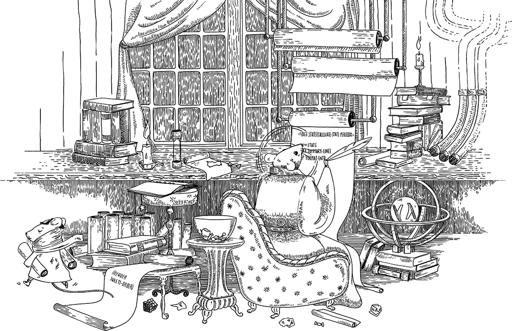

# Ash Ra Template

[](LICENSE.txt)
[](https://clojars.org/net.vivid-inc/art)
[](https://cljdoc.org/d/net.vivid-inc/art)
[](https://circleci.com/gh/vivid-inc/ash-ra-template/tree/art-0.7.1)
[](https://codecov.io/gh/vivid-inc/ash-ra-template)

Expressive & customizable template system featuring Clojure language processing.
The essence of ART (at 1.0) is:
- *Clojure processing*: A template processor that passes files through with Clojure processing of code blocks.
- *Composable*: Near-frictionless integration with it's public APIs and CLI.
- *Customizable*: Like Git, ART exposes 2 layers, plumbing (libraries of public APIs you can leverage to build your solutions) and porcelain (finished templating system that you can use in your code as well as a full CLI-based templating solution).
- *Expressive*: Unconstrained limit on expressing yourself. With no limited library to restrict your freedom.  There is no library of functions like Selmer and other templating systems; you bring your own.
- *High quality*: Sufficient test coverage, near bullet-proof, satisfying ergonomics.

Tested with Clojure 1.10.0 and newer, and with Java 8 and newer LTS releases.


## Components

[ART library](art/README.md), the renderer proper. Includes detailed information about using the ART library and ART template syntax, rendering API and options, and processing.

[ART CLI library](art-cli/README.md) aggregates code common to the interpretation and processing of ART build tool and command line arguments.

[Clojure tool](clj-art/README.md) for rendering ART templates.

[Leiningen plugin](lein-art/README.md) for rendering ART templates.


<a name="quickstart"></a>
## Quick Start

Include this library from Clojars by adding the latest version of ``net.vivid-inc/art`` to your project dependencies:
```clojure
; Clojure tools deps.edn
{:deps {net.vivid-inc/art {:mvn/version "0.7.1"}}}

; Leiningen project.clj
:dependencies [[net.vivid-inc/art "0.7.1"]]
```

Render a template string:
```clojure
(require '[vivid.art :as art])

(art/render "There were <(= (+ 1 2) )> swallows, dancing in the sky.")
```

Or, to render from a file:
```clojure
(art/render (slurp "index.html.art"))
```

#### Use cases
- Automating the bulk generation of data files, such as SQL unit tests in data science, per-language I18n/M10n files.
- HTTP server templating engine, dynamic web content.
- Static website generation (SSG), including HTML pages, blog articles, navigation, layouts, headers and footers, templated SVG images.
- Templating source code files, for example to encode project meta-data as variables written in a source file.


## Contributing

**Pull Requests** are welcome!
We work with people offering PRs to revise and iterate leading to solutions in accord with project goals and [release criteria](QUALITY.md).
Development topics and product roadmap are maintained in [DEVELOP.md](DEVELOP.md). 
Commits must include Signed-off-by indicating acceptance of the [Developer's Certificate of Origin](DCO.txt).
Unproductive behavior such as unkindness towards others and derailment is not tolerated.


## Attributions

- Original implementation by [Vivid Inc.](https://vivid-inc.net)
- Illustration by [Ruxandra](https://www.instagram.com/chocolatechiphelmet/).



Of the Clojure templating libraries we examined, none seemed to assist in porting a non-trivial amount of ERB-templated content to a Clojure-based static site generation tool.
We find the ability to in-line arbitrary Clojure code is intoxicatingly pragmatic (also expressed as: Enough rope to hang oneself).
Seeking to wield such expressive power in a general-purpose templating system, we wrote Ash Ra Template, or **ART**.


## License

© Copyright Vivid Inc.
[Apache License 2.0](LICENSE.txt) licensed.
